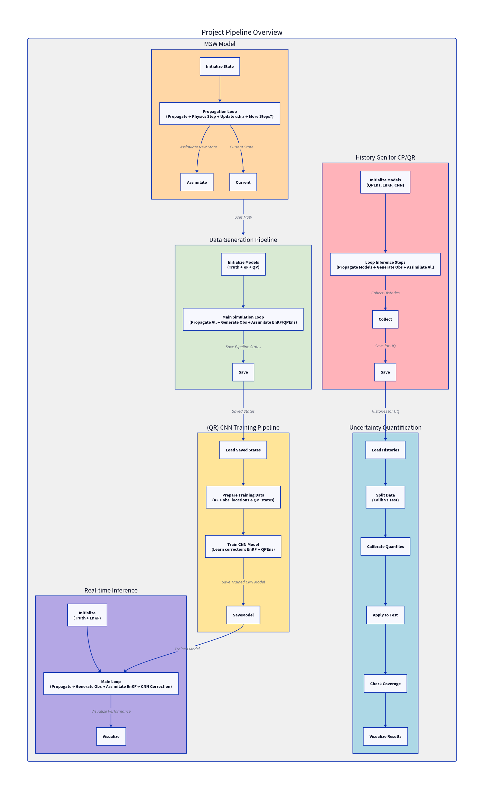
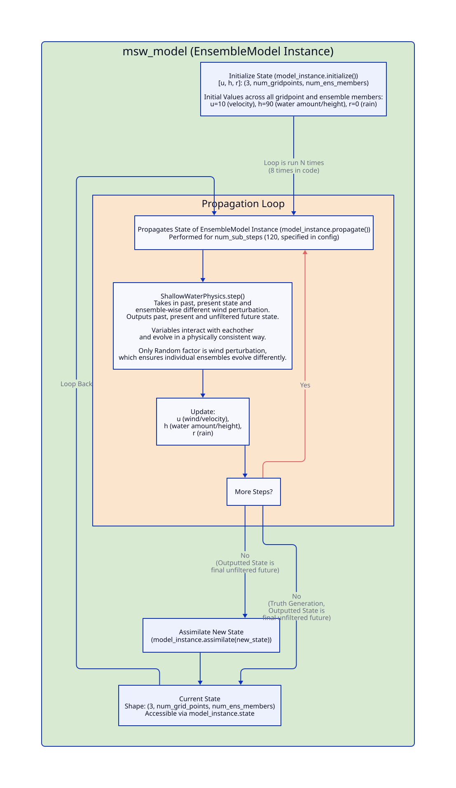
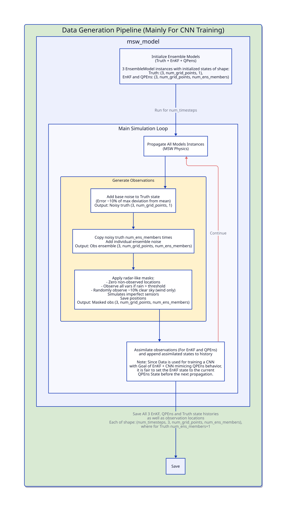
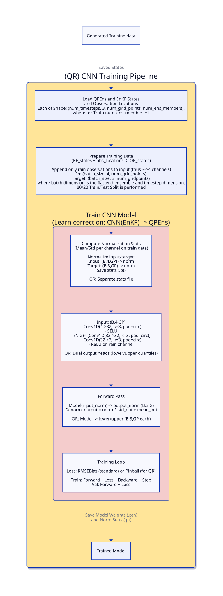
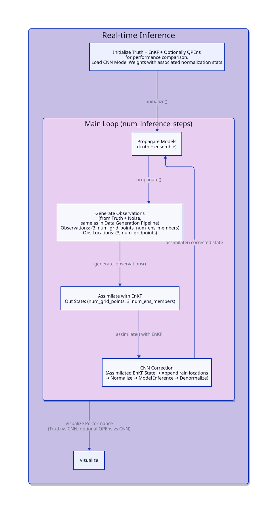
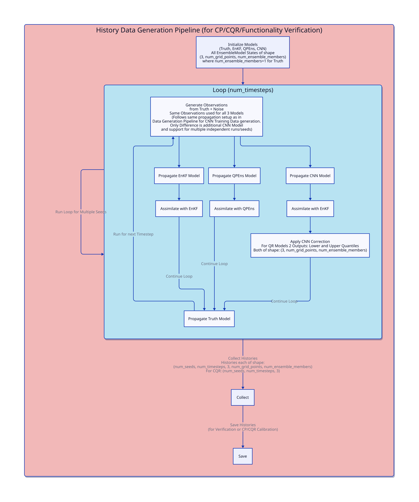
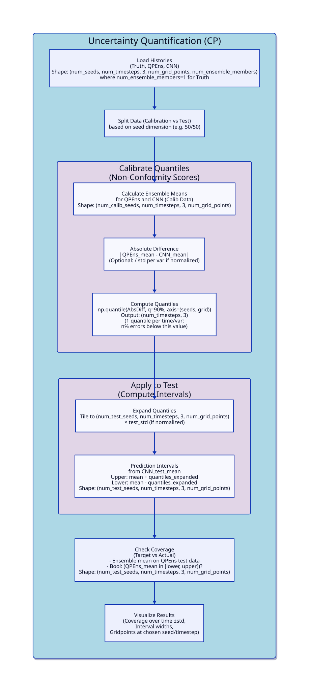
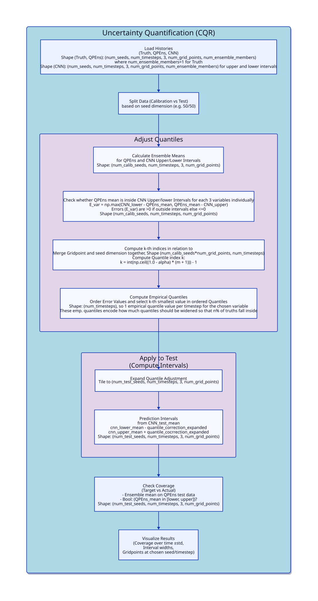

# Reimplementation: Training a Convolutional Neural Network to Conserve Mass in Data Assimilation

This repository contains a Python reimplementation of the paper:

**"Training a convolutional neural network to conserve mass in data assimilation"**
by Ruckstuhl, Y. and Janji\'c, T. and Rasp, S.

*Paper: [doi.org/10.5194/npg-28-111-2021](https://doi.org/10.5194/npg-28-111-2021)*

The original authors code can be found at: [zenodo.org/records/4354602](https://zenodo.org/records/4354602)

## Project Overview

This project implements a shallow water model (MSW) with data assimilation techniques, including Ensemble Kalman Filter (EnKF), Quadratic Programming Ensemble (QPEns), and a CNN for mass conservation corrections. It also includes uncertainty quantification via methods like Conformal Prediction.

## Source Layout

The current code layout is:

```text
msw_da_ml/
  core/
    msw_model.py          # MSW physical model
    assimilation.py       # EnKF and QPEns
    observations.py       # noisy observations and radar mask generation
    random.py             # split random generators

  data/
    training_sequences.py # QPEns/EnKF training sequence generation
    evaluation_sequences.py # CNN/CP base evaluation sequence generation

  models/
    cnn.py                # standard CNN correction model
    cqr.py                # quantile CNN head
    mcdo.py               # MC dropout mean/logvar head
    evidential.py         # normal-inverse-gamma evidential head

  training/
    train_cnn.py
    train_cqr.py
    train_mcdo.py
    train_evidential.py
    evidential_common.py
    losses.py
    cqr_losses.py
    evidential_losses.py

  inference/
    cnn_sequence.py       # model loading and CNN inference
    base_sequence.py      # reuse CNN base sequences for UQ methods
    cqr_model_io.py
    cqr_sequence.py
    mcdo_sequence.py
    evidential_sequence.py

  uncertainty/
    split_cp.py           # split CP, normalized CP, MCDO/NIG interval helpers
    cqr.py                # CQR calibration/evaluation
    rf_normalizer.py      # RF normalizer
    uq_comparison.py      # comparison plots

  evaluation/
    rmse.py
    coverage.py
    plotting.py

  cli.py
  settings.py
  config.yaml
```

### End-to-End Pipeline


*High-level overview of the entire pipeline. (Click for full size; individual diagrams available in the next section.*

### Detailed Diagrams
<details>
<summary>Expand for Individual Diagrams</summary>
   
   
   
   
   
   
   
</details>

## Quick Start

### Setup
```bash
git clone https://github.com/OlegTolochko/msw-da-ml.git
cd msw-da-ml/
pip install -e .  # Install in development mode
```

### Running the Pipeline
(or use the pretrained set of models + sequence histories directly provided in a zenodo DOI: https://zenodo.org/records/20393004)

1. **Generate a training sequence:**
   ```bash
   python -m msw_da_ml.cli generate-training-data
   ```

2. **Train a CNN model:**
   ```bash
   python -m msw_da_ml.cli train-cnn-model <training_sequence_name>
   ```

3. **Run inference:**
   ```bash
   python -m msw_da_ml.cli run-inference
   ```

4. **Generate evaluation sequences for uncertainty quantification:**
   ```bash
   python -m msw_da_ml.cli generate-conformal-prediction-data
   ```

5. **Compare different uncertainty quantification methods:**
   ```bash
   python -m msw_da_ml.cli compare-uq-methods <cp_sequence> <cqr_sequence>
   ```

### Useful Commands

```bash
# Show all available commands
python -m msw_da_ml.cli --help

# List trained models
python -m msw_da_ml.cli list-available-models

# List training/evaluation sequences
python -m msw_da_ml.cli list-available-data

# Get detailed help for any command
python -m msw_da_ml.cli <command> --help
```

## Configuration

Model parameters and experiment settings can be configured in `config.yaml`.
